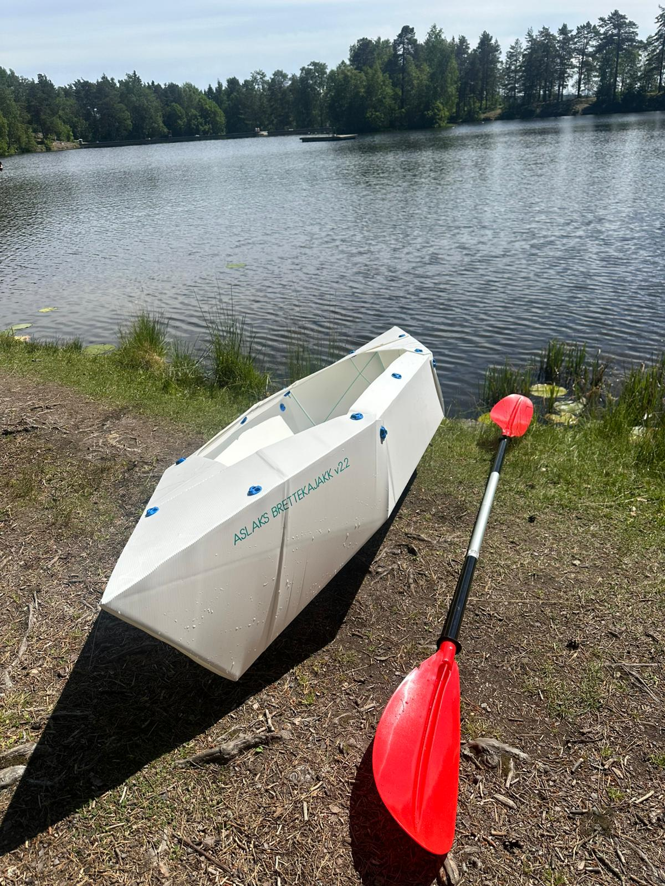

# Aslags Folding Kayak
Design improvements and contributions to a kayakk that can be folded from a singele sheet of PP

### To do:
- Change all spelling of inventors name from Aslak to Aslag
- Add invenstors surname to doku
- Add pics
- Add description
- Add list of of design contributions / improvements

### The inventor for the folding Kayakk:
https://www.instagram.com/aslagsbrettekajakk/reel/DQH3vtzCDOd/

### BOM:
- 2440mm x 1220mm fluted / corrugated polypropylene sheet - 4mm thickness - 2pcs
- M5 hex head screws 30mm length - About 20pcs
- M5 nuts - About 20pcs
- Filament for 3D printing lock washers

